# Laboratorio #4 — CRUD con MySQL

<p align="center">
  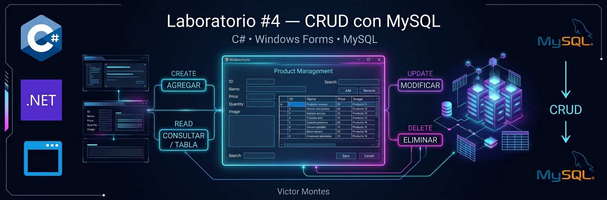
</p>

<p align="center">
  <strong>Aplicación de escritorio para la gestión de productos mediante operaciones CRUD</strong>
</p>

<p align="center">
  
  
  
  
  
  
  
</p>

---

## Información del Laboratorio

| Campo                    | Información                             |
| ------------------------ | --------------------------------------- |
| **Laboratorio**          | #4                                      |
| **Título**               | Introducción a Base de Datos con MySQL  |
| **Fecha**                | 21/09/2026                              |
| **Lenguaje**             | C#                                      |
| **Framework**            | .NET Framework 4.7.2                    |
| **Interfaz**             | Windows Forms                           |
| **Base de datos**        | MySQL                                   |
| **IDE**                  | Visual Studio                           |
| **Control de versiones** | Git / GitHub                            |
| **Autor**                | Victor Montes                           |
| **Institución**          | Universidad Tecnológica de Panamá — UTP |

---

## Contenido del Repositorio

Este laboratorio presenta una aplicación de escritorio desarrollada en **C# con Windows Forms**, conectada a una base de datos **MySQL**, cuyo objetivo es implementar las operaciones fundamentales de un sistema CRUD para la gestión de productos.

La aplicación permite:

* Registrar nuevos productos.
* Consultar productos almacenados.
* Buscar productos mediante un campo de búsqueda.
* Modificar información existente.
* Eliminar productos.
* Visualizar imágenes asociadas a cada producto.
* Almacenar las imágenes directamente en MySQL mediante campos `LONGBLOB`.
* Validar los datos introducidos antes de ejecutar las operaciones.
* Mostrar los registros almacenados mediante un `DataGridView`.

### Objetivo del laboratorio

Aplicar los conceptos de conexión entre una aplicación de escritorio y una base de datos relacional, utilizando consultas SQL parametrizadas para realizar operaciones de inserción, consulta, actualización y eliminación.

---

## Tecnologías Utilizadas

### Lenguaje y Framework

<p>
  
</p>

| Tecnología               | Uso                                |
| ------------------------ | ---------------------------------- |
| **C#**                   | Lenguaje principal de programación |
| **.NET Framework 4.7.2** | Plataforma de ejecución            |
| **Windows Forms**        | Desarrollo de la interfaz gráfica  |
| **MySQL**                | Sistema gestor de base de datos    |
| **MySql.Data**           | Conector entre C# y MySQL          |
| **Visual Studio**        | Entorno de desarrollo              |

### Herramientas

<p>
  
</p>

* Visual Studio
* Git
* GitHub
* MySQL
* MySQL Workbench
* .NET Framework
* Windows Forms

---

## Arquitectura General

La aplicación utiliza una estructura sencilla en la que la interfaz de usuario se comunica con una clase encargada de gestionar la conexión y las operaciones sobre MySQL.

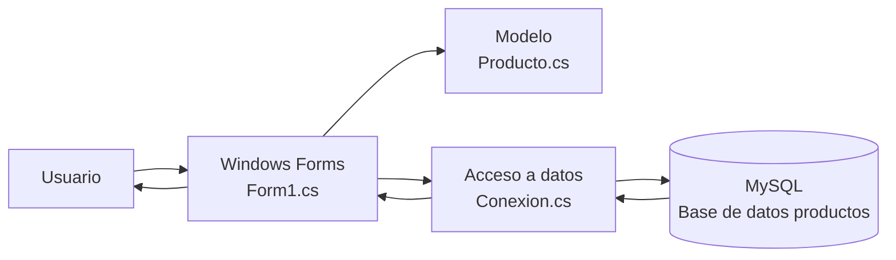

### Flujo de información

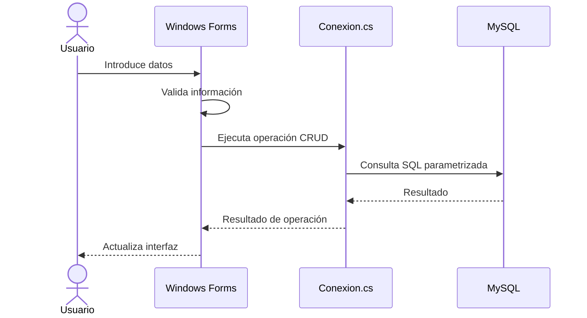

---

# Operaciones CRUD

La aplicación implementa las cuatro operaciones principales de persistencia de datos:

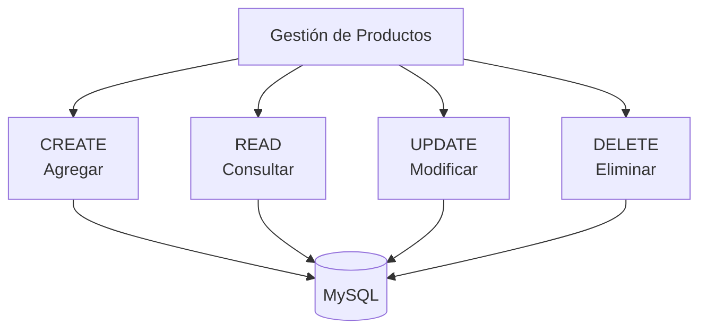

| Operación  | Acción en la aplicación | Consulta utilizada |
| ---------- | ----------------------- | ------------------ |
| **CREATE** | Agregar producto        | `INSERT`           |
| **READ**   | Consultar / buscar      | `SELECT`           |
| **UPDATE** | Modificar producto      | `UPDATE`           |
| **DELETE** | Eliminar producto       | `DELETE`           |

---

## Base de Datos

La aplicación utiliza una base de datos denominada `productos`.

La tabla principal es:

```text
productos
├── id
├── nombre
├── precio
├── cantidad
└── imagen
```

### Modelo de datos

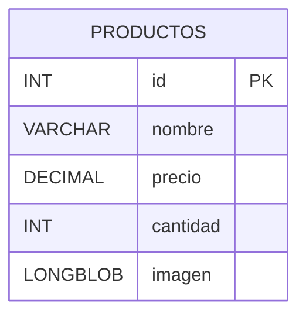

### Descripción de los campos

| Campo      | Tipo            | Descripción                           |
| ---------- | --------------- | ------------------------------------- |
| `id`       | `INT`           | Identificador único y autoincremental |
| `nombre`   | `VARCHAR(100)`  | Nombre del producto                   |
| `precio`   | `DECIMAL(10,2)` | Precio del producto                   |
| `cantidad` | `INT`           | Cantidad disponible                   |
| `imagen`   | `LONGBLOB`      | Imagen asociada al producto           |

---

## Capturas de Pantalla

Las siguientes capturas muestran el funcionamiento principal de la aplicación.

### Interfaz Principal

La pantalla principal permite visualizar los productos registrados, realizar búsquedas y acceder a las operaciones disponibles.

<p align="center">
  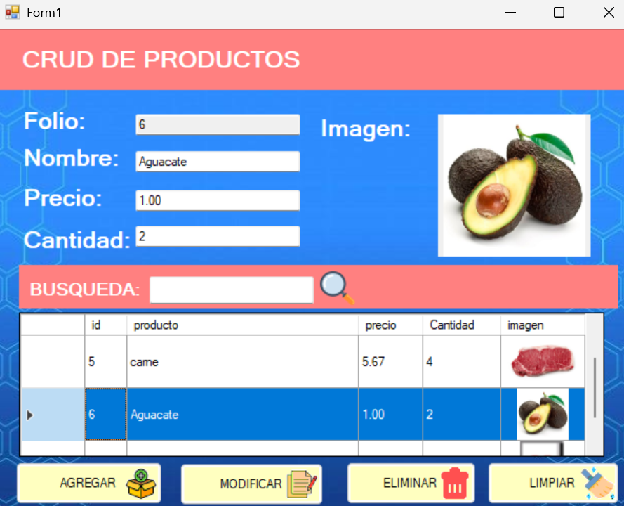
</p>

---

### Producto Agregado

Esta captura muestra el resultado de la operación de creación de un nuevo producto.

<p align="center">
  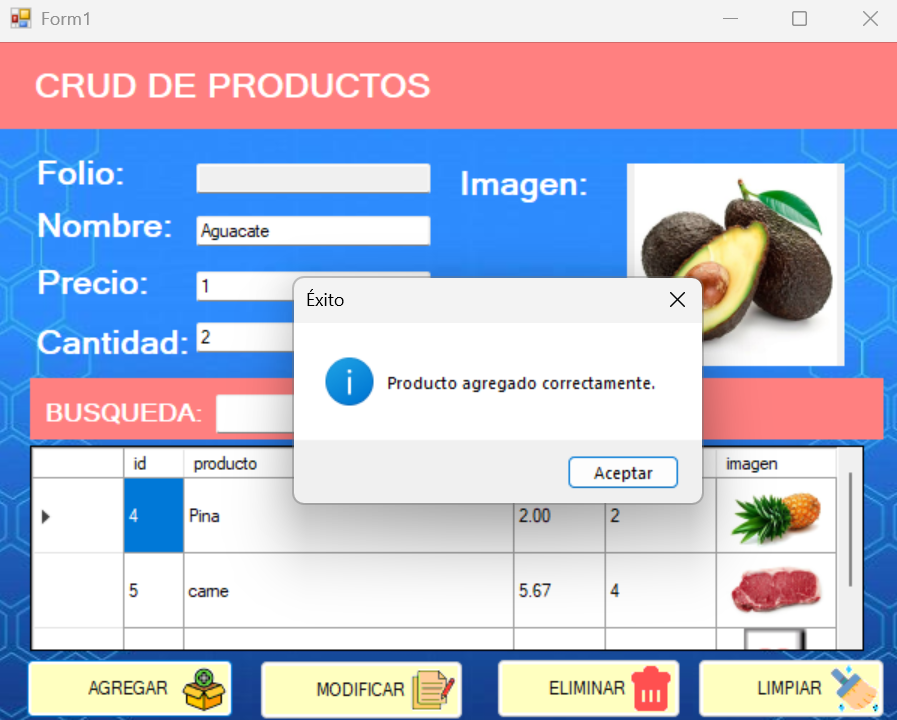
</p>

---

### Eliminación de Producto

Esta captura muestra el flujo correspondiente a la eliminación de un registro.

<p align="center">
  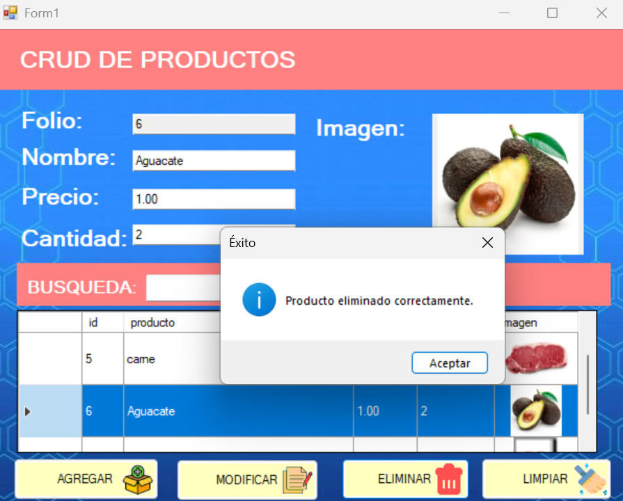
</p>

---

# Problemas / Ejercicios

## Ejercicio 1 — Conexión con MySQL

Se implementó una clase encargada de administrar la conexión entre la aplicación desarrollada en C# y el servidor MySQL.

La conexión utiliza:

* Servidor local.
* Base de datos `productos`.
* Usuario `root`.
* Conector `MySql.Data`.

La cadena de conexión se mantiene con la contraseña como valor configurable para evitar publicar credenciales reales en el repositorio.

---

## Ejercicio 2 — Registro de Productos

Se implementó la operación **CREATE**, permitiendo registrar productos mediante los siguientes datos:

```text
Nombre
Precio
Cantidad
Imagen
```

La información es enviada a MySQL mediante una sentencia `INSERT`.

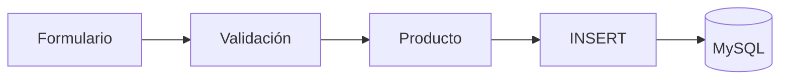

---

## Ejercicio 3 — Consulta y Búsqueda

La operación **READ** obtiene los productos almacenados en la base de datos y los muestra mediante un `DataGridView`.

También se implementó un campo de búsqueda que permite filtrar los resultados.

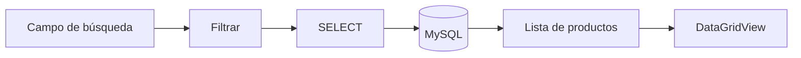

El filtro puede realizar búsquedas sobre los campos principales del producto:

* ID
* Nombre
* Precio
* Cantidad

---

## Ejercicio 4 — Modificación de Productos

La operación **UPDATE** permite seleccionar un producto existente, cargar sus datos en el formulario y modificar la información almacenada.

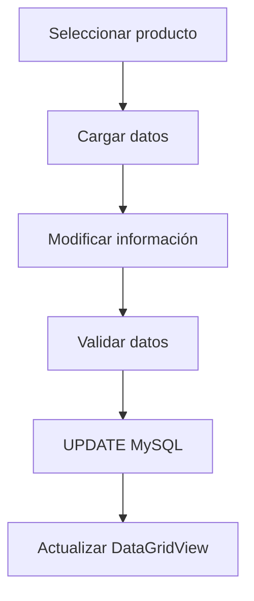

---

## Ejercicio 5 — Eliminación de Productos

La operación **DELETE** permite eliminar un producto utilizando su identificador.

Antes de realizar la operación, la aplicación solicita una confirmación al usuario para evitar eliminaciones accidentales.

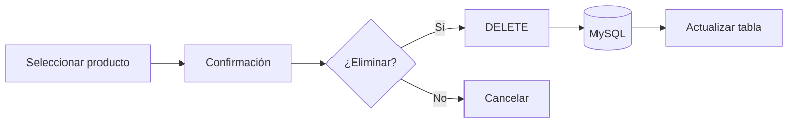

---

## Gestión de Imágenes

Una característica adicional del laboratorio es la posibilidad de asociar imágenes a los productos.

La aplicación permite:

1. Seleccionar una imagen desde el equipo.
2. Convertirla a `byte[]`.
3. Almacenarla en MySQL.
4. Recuperarla posteriormente.
5. Convertir nuevamente los datos a una imagen.
6. Mostrarla dentro del `DataGridView`.

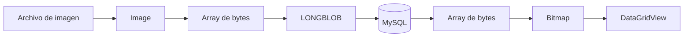

---

# Estructura de Carpetas o Directorios

La organización principal del proyecto es la siguiente:

```text
CRUD-WindowsForms-MySQL/
│
├── Introducción a Base de Datos con MySQL/
│   │
│   ├── Conexion.cs
│   ├── Form1.cs
│   ├── Form1.Designer.cs
│   ├── Form1.resx
│   ├── Producto.cs
│   ├── Program.cs
│   │
│   ├── App.config
│   ├── packages.config
│   │
│   └── Properties/
│       ├── AssemblyInfo.cs
│       ├── Resources.resx
│       ├── Resources.Designer.cs
│       ├── Settings.settings
│       └── Settings.Designer.cs
│
├── database/
│   └── productos.sql
│
├── assets/
│   ├── banner.png
│   ├── vista-principal.png
│   ├── producto-agregado.png
│   └── eliminar-producto.png
│
├── .gitignore
├── README.md
└── Introducción a Base de Datos con MySQL.sln
```

### Descripción de los archivos principales

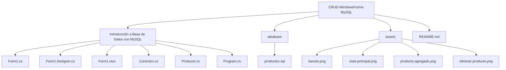

---

# Instrucciones de Ejecución / Uso

## 1. Requisitos

Antes de ejecutar el proyecto se recomienda tener instalado:

* Windows.
* Visual Studio.
* .NET Framework 4.7.2.
* MySQL Server.
* MySQL Workbench.
* Git.

---

## 2. Clonar el repositorio

Desde una terminal:

```bash
git clone https://github.com/VITIDEV06/CRUD-WindowsForms-MySQL.git
```

Entrar al directorio:

```bash
cd CRUD-WindowsForms-MySQL
```

---

## 3. Configurar la base de datos

Abrir **MySQL Workbench** y ejecutar el script ubicado en:

```text
database/productos.sql
```

El script crea la estructura necesaria para la tabla `productos`.

```sql
CREATE DATABASE IF NOT EXISTS productos;
USE productos;
```

Posteriormente se crea la tabla correspondiente a los registros utilizados por la aplicación.

---

## 4. Configurar la conexión

Abrir el archivo:

```text
Introducción a Base de Datos con MySQL/Conexion.cs
```

Configurar los datos de conexión local:

```csharp
private static readonly string cadenaConexion =
    "Server=localhost;Database=productos;Uid=root;Pwd=TU_CONTRASENA;";
```

Se debe sustituir:

```text
TU_CONTRASENA
```

por la contraseña configurada en el servidor MySQL local.

> No se deben publicar contraseñas reales ni credenciales privadas en GitHub.

---

## 5. Abrir el proyecto

Abrir en Visual Studio:

```text
Introducción a Base de Datos con MySQL.sln
```

Esperar a que Visual Studio restaure las dependencias del proyecto.

---

## 6. Ejecutar

Desde Visual Studio:

```text
Compilar → Compilar solución
```

o utilizar:

```text
Ctrl + Shift + B
```

Posteriormente ejecutar:

```text
Depurar → Iniciar sin depuración
```

o:

```text
Ctrl + F5
```

---

# Funcionamiento General

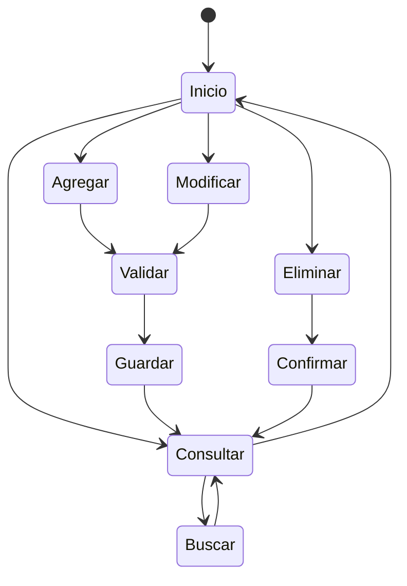

---

# Componentes Principales

## `Form1.cs`

Contiene la lógica relacionada con la interfaz gráfica y las acciones realizadas por el usuario.

Entre sus responsabilidades se encuentran:

* Cargar productos.
* Agregar productos.
* Modificar productos.
* Eliminar productos.
* Limpiar campos.
* Buscar productos.
* Seleccionar imágenes.
* Validar información.
* Mostrar resultados en el `DataGridView`.

---

## `Conexion.cs`

Centraliza las operaciones relacionadas con MySQL.

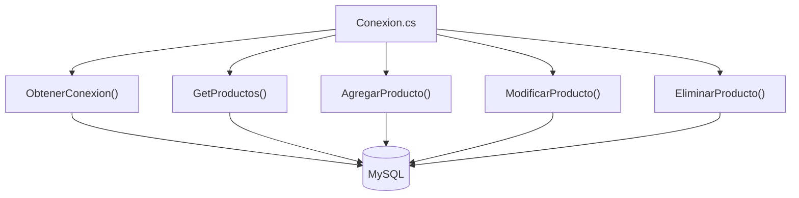

---

## `Producto.cs`

Representa la información de un producto mediante un modelo sencillo:

```text
Producto
│
├── Id
├── Nombre
├── Precio
├── Cantidad
└── Imagen
```

Este modelo permite transportar la información entre la interfaz y la capa de acceso a datos.

---

## `Program.cs`

Contiene el punto de entrada de la aplicación y se encarga de iniciar el formulario principal.

---

# Buenas Prácticas Aplicadas

Durante el desarrollo se utilizaron diferentes prácticas para mantener el proyecto organizado y funcional:

* Separación de la lógica de conexión en `Conexion.cs`.
* Uso de una clase `Producto` para representar los datos.
* Consultas SQL parametrizadas.
* Validación de campos antes de realizar operaciones.
* Liberación de recursos mediante `using`.
* Manejo de excepciones.
* Confirmación antes de eliminar registros.
* Uso de `.gitignore`.
* Exclusión de archivos generados por Visual Studio.
* Exclusión de credenciales reales.
* Organización de recursos gráficos dentro del proyecto.
* Documentación del código mediante comentarios XML en las clases y métodos principales.

---

# Tecnologías y Flujo del Proyecto

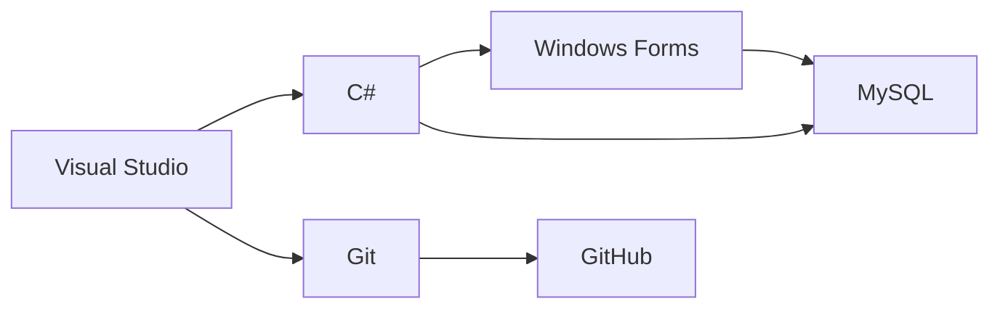

---

# Resultado Esperado

Al ejecutar correctamente el proyecto, el usuario debe visualizar una aplicación Windows Forms capaz de:

```text
┌─────────────────────────────────────────────┐
│          GESTIÓN DE PRODUCTOS              │
├─────────────────────────────────────────────┤
│                                             │
│  Folio:       [       ]                     │
│  Nombre:      [       ]                     │
│  Precio:      [       ]                     │
│  Cantidad:    [       ]                     │
│  Imagen:      [       ]                     │
│                                             │
│  [Agregar] [Modificar] [Eliminar] [Limpiar]│
│                                             │
├─────────────────────────────────────────────┤
│  BÚSQUEDA: [                    ]            │
├─────────────────────────────────────────────┤
│ ID │ Producto │ Precio │ Cantidad │ Imagen │
├────┼──────────┼────────┼──────────┼────────┤
│ 01 │ Producto │ 10.00  │    5     │  IMG   │
└─────────────────────────────────────────────┘
```

---

# Autor y Contexto

**Nombre:** Victor Montes

**Institución:** Universidad Tecnológica de Panamá

**Facultad:** Facultad de Ingeniería de Sistemas Computacionales

**Carrera:** Ingeniería en Sistemas y Computación

**Fecha de realización:** 21/09/2026

**Contexto:** Laboratorio académico de introducción a bases de datos utilizando C#, Windows Forms y MySQL.

---

# Referencias

## Material de apoyo

* Documentación oficial de C# y .NET.
* Documentación de Windows Forms.
* Documentación oficial de MySQL.
* Material proporcionado durante el laboratorio.
* Video de apoyo utilizado durante el desarrollo de la práctica.

## Win32OpenSSL

**Win32OpenSSL** corresponde a una implementación de OpenSSL para entornos Windows y se incluye como referencia relacionada con herramientas y componentes utilizados en entornos de desarrollo.

---

# Repositorio

<p align="center">
  <a href="https://github.com/VITIDEV06/CRUD-WindowsForms-MySQL">
    
  </a>
</p>

<p align="center">
  <strong>Laboratorio #4 — Introducción a Base de Datos con MySQL</strong><br>
  C# • Windows Forms • .NET Framework • MySQL
</p>

<p align="center">
  Victor Montes · Universidad Tecnológica de Panamá
</p>
